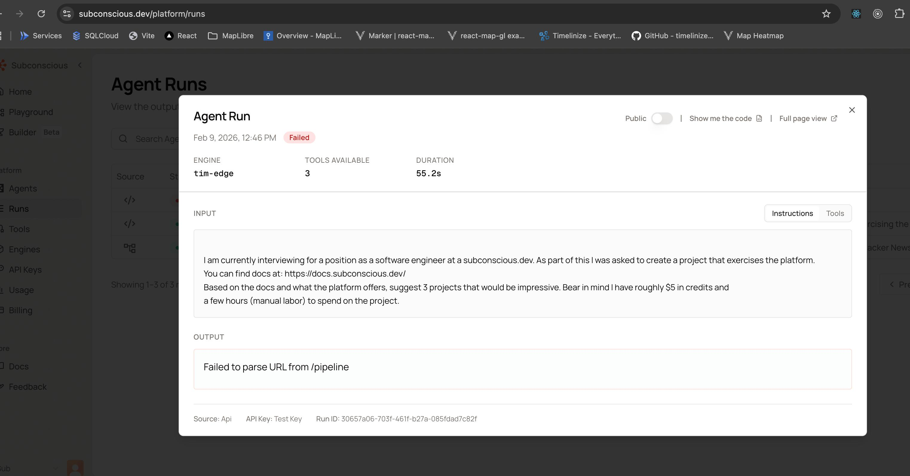
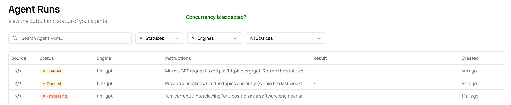
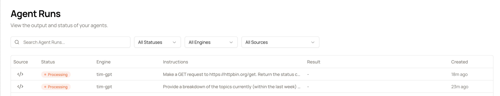
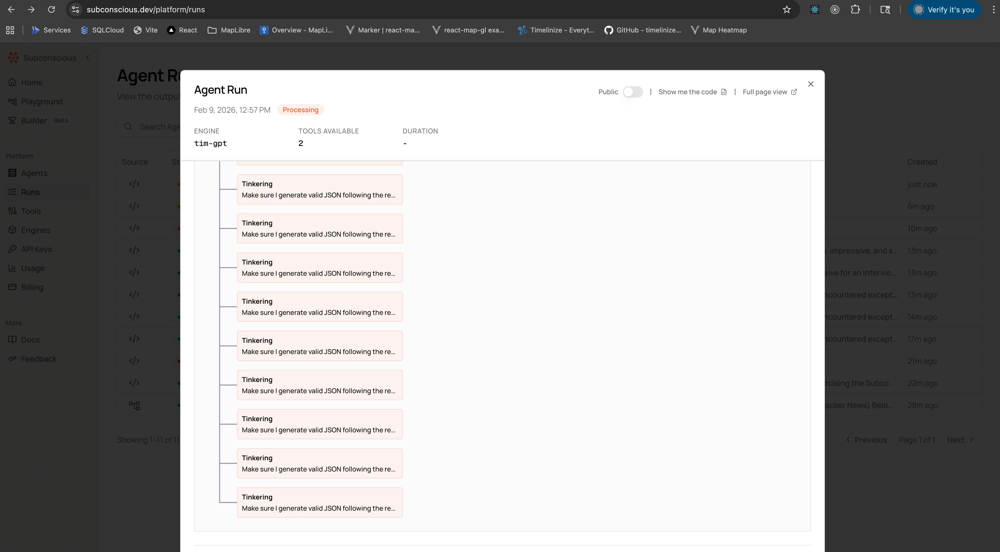
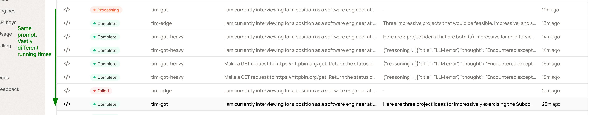
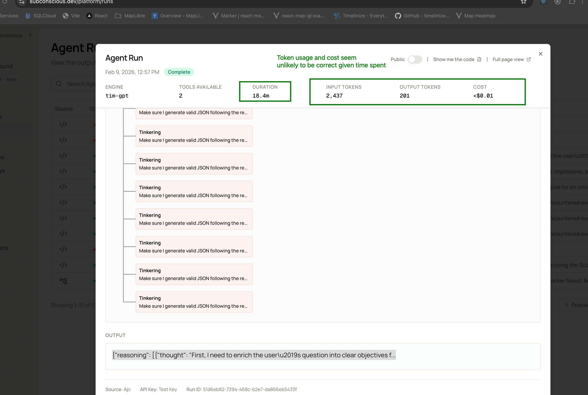

# Hacker News Sentiment Analysis
Ok, realized this was partially my fault. I was including a tool that wasn't available, but we are seeing divergent behavior between the 3 engines: 
- `tim-gpt` succeeded with this mistake
- `tim-gpt-heavy` failed with this mistake (silently)
- `tim-edge` failed with this mistake (loudly (labeled itself as a error))

## Tim Edge failure
```python
run = client.run(
    engine="tim-gpt",
    input={
        "instructions": simple_tool_check,
        "tools": [
            {"type": "platform", "id": "parallel_search"},
            {"type": "platform", "id": "parallel_extract"},
            get_requests_tool(NGROK_URL),
        ],
        # "answerFormat": HN_Sentiment_Analysis,
    },
    options={"await_completion": True},
)
```
- Shows as an error (correctly)
- 

## Tim Heavy failure
- Note: Shows as successful, but the output is the reasoning trace, not the answer and its full of errors. 


# Concurrency?
- I almost always saw things running sequentially. Talking with Jack, seems like it should be possible to run things concurrently.
    - 

- Got some concurrency, here, unclear what was different for the system to allow this:
    - 


# Long running (possibly never terminating) runs (`Tinkering` case)
- Lots of `tinkering` traces
- 

- Substantially similiar invocations (I think they only differ on the # of tools, resulted in very different run times)
    - Unsure if this will actually terminate (Would be nice to be able to kill a job (or set a max run time)))
- 

- Finished state:
    - 

# SDK Code does not capture all the details of the run

- Note: There is an extensive `structured output` model defined, but it doesn't show it in the code from the Dashboard.
- Also, `await_completion` has the wrong value.
```python
run = client.run(
    engine="tim-gpt",
    input={
        "instructions": hn_instructions,
        "tools": [
            {"type": "platform", "id": "parallel_search"},
            {"type": "platform", "id": "parallel_extract"},
            # get_requests_tool(NGROK_URL),
        ],
        "answerFormat": HN_Sentiment_Analysis,
    },
    options={"await_completion": False},
)
```

My actual code:
```python
import Subconscious from '@subconscious/sdk';

const client = new Subconscious({
  apiKey: process.env.SUBCONSCIOUS_API_KEY,
});

const run = await client.runs.create({
  engine: 'tim-gpt',
  input: {
    instructions: `Provide a breakdown of the topics currently (within the last week) being discussed on Hacker News (https://news.ycombinator.com/). 
Limit yourself to 20 posts total.
I want 2 breakdowns:
1. Group by 3 broad categories and the sentiment of the comments of the grouped posts.
2  Provide a heirarchical breakdown of each broad category into posts that were incorporated into it. 
Include the top 5 posts as measured by number of comments. 
The Post entries should have a summary (1-2 sentences), a link to it, and a sentiment score (1-5).`,
    tools: [
      { type: 'platform', id: 'parallel_search' },
      { type: 'platform', id: 'parallel_extract' }
    ],
  },
  options: { awaitCompletion: true },
});

console.log(run.result);
```
