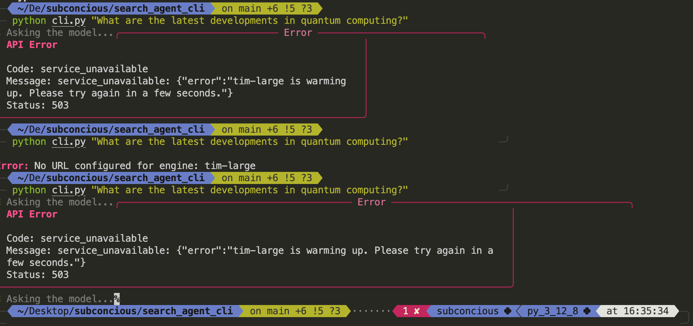
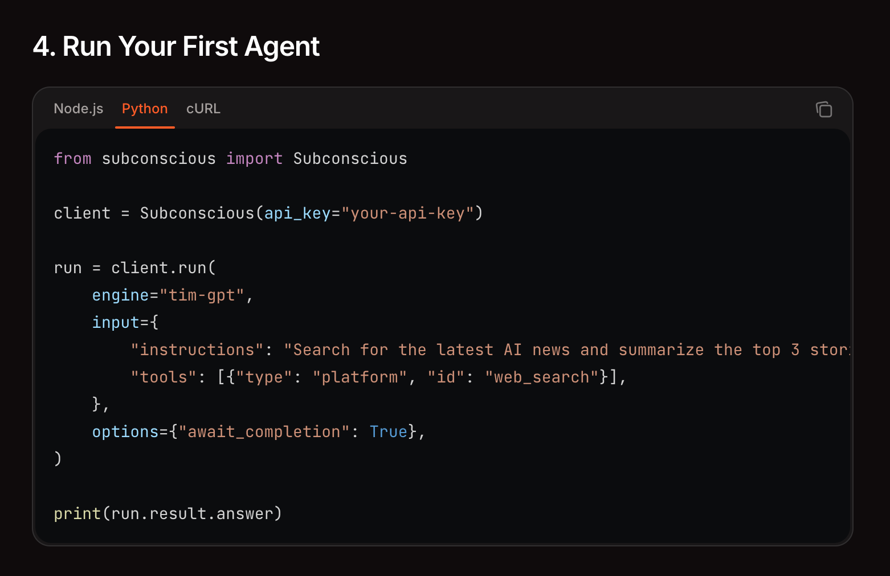
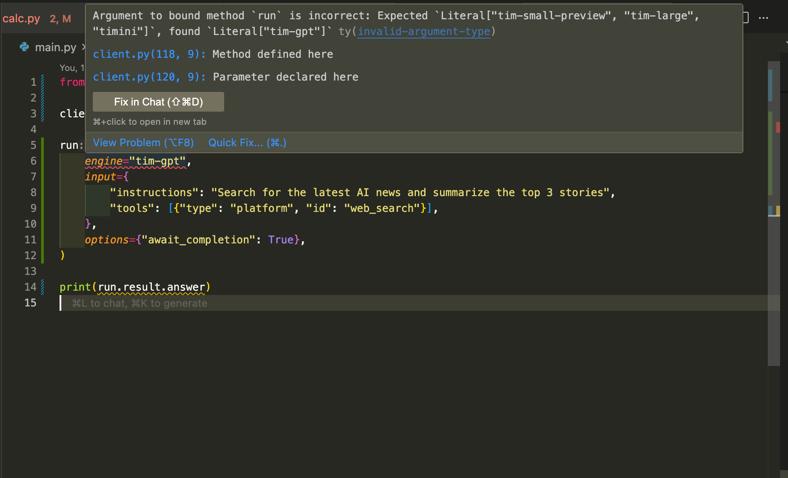

# Purpose
- Going thru Subconscious's:
    - [repos](https://github.com/subconscious-systems/subconscious)
    - [documentation](https://docs.subconscious.dev/overview)
    - [blog posts](https://www.subconscious.dev/blog/)
    - [papers](https://arxiv.org/pdf/2507.16784)
    - [Published Model](https://huggingface.co/papers/2507.16784)
    - taking notes.

# Worked well
- `e2b_cli` example

# Errors encountered
## API doesn't return answer, but the Run summary has one
- Run ID: f5b543c0-bce8-4447-8089-629dc26c764c
- Seems to be happening pretty often.
- Simple enough workaround: `run = client.get(run_id="54badb30-088c-469d-9b54-b381c46859db")`

## Repeated identical error detected 10 times (sig=error); stopping stream early.
- Note: This was a `tim-gpt-heavy` engine usage. Ran into this twice.
- Run ID: 207f8515-c4d3-48b5-8e50-7a7b95fa8c03

## Doesn't seem to be taking the Output Model into account
I had a pretty elaborate output model defined, but it doesn't show it in the code from the Dashboard. Not sure if it does or doesn't see it (or if this is just a display bug)
```python
import Subconscious from '@subconscious/sdk';

const client = new Subconscious({
  apiKey: process.env.SUBCONSCIOUS_API_KEY,
});

const run = await client.runs.create({
  engine: 'tim-gpt-heavy',
  input: {
    instructions: `Provide a breakdown of the topics currently (within the last week) being discussed on Hacker News (https://news.ycombinator.com/). 
I want 2 breakdowns:
1. Group by broad categories and the sentiment of the comments of the grouped posts.
2  Provide a heirarchical breakdown of each broad category into posts that were incorporated into it. 
Include the top 5 posts as measured by number of comments. 
The Post entries should have a summary (1-2 sentences), a link to it, and a sentiment score (1-5).`,
    tools: [
      { type: 'platform', id: 'parallel_search' },
      { type: 'platform', id: 'exa_crawl' },
      { type: 'platform', id: 'parallel_extract' }
    ],
  },
  options: { awaitCompletion: true },
});

console.log(run.result);
```

## Engines documented in the docs vs what the SDK actually supports
- `type Engine = 'tim-small-preview' | 'tim-large' | 'timini' | (string & {});`
- `https://docs.subconscious.dev/engines#available-engines`

## The Quickstart guide is outdated and doesn't work.
    - Seems to be using an older library version `subconscious-python` vs `subconscious-sdk`.
## The `examples` have a lot of varying degrees of completeness/polish. 
- Would be nice to have a docker compose to setup examples like this: https://github.com/subconscious-systems/subconscious/blob/main/examples/browser_use/agent.py

## Warming up
When running: https://github.com/subconscious-systems/subconscious/tree/main/examples/search_agent_cli


## Main Docs page example 
### Uses a bad string for the engine: `tim-gpt`
- 
- 
```python
Literal["tim-small-preview", "tim-large", "timini"]
(type) Engine = Literal['tim-small-preview', 'tim-large', 'timini']
```
### Fails consistently
- `Run(run_id='114cc346-d0cd-4c32-bde2-2d52ac5796e8', status='failed', result=RunResult(answer='', reasoning=''), usage=Usage(models=[], platform_tools=[]))`
- 

# Nitpicky stuff
- [CURL example for Streaming](https://docs.subconscious.dev/core-concepts/streaming#basic-usage)
    - I'm guessing you get back a `runId` and then you can poll for the result? Should be explicit about usage example. 
- Write the engine specific costs in as constants, provide cost values directly vs making the user look it up in the docs. [here](https://docs.subconscious.dev/guides/response-handling#tracking-costs)
- `Thread` implies parallelism to developers, just a heads up.
    - Also, just want to be sure, this is a single-agent system, right? I have some trouble understanding how to read images like: https://www.subconscious.dev/_next/image?url=https%3A%2F%2Fcdn.sanity.io%2Fimages%2Fs764co7b%2Fproduction%2Fd53e36ef3fea76b12405afe82158893794b553dc-2046x1116.jpg%3Fq%3D100&w=3840&q=75

# Open Questions
- Thought that the TIMRUN runtime was private? (https://github.com/subconscious-systems/subconscious)
- I see the tool defs match the OpenAI's tool definition schema and add on to it, but I wonder if it wouldn't be beneficial to also add a schema for the output to allow for more structured/interpretable outputs?
Cursor's comparison of OpenAI's tool definition schema and Subconscious's tool definition schema:
```json
tools = [
    {
        "type": "function",
        "name": "web_search",
        "description": "Search the web for current information",
        "url": "https://...",  # Subconscious extension
        "method": "GET",       # Subconscious extension
        "timeout": 30,         # Subconscious extension
        "parameters": {        # Same JSON Schema format
            "type": "object",
            "properties": {
                "query": {
                    "type": "string",
                    "description": "The search query"
                }
            },
            "required": ["query"]
        }
    }
]
```

- Also, can Subconcious's API really hit localhost?
    - Answered [here](https://docs.subconscious.dev/core-concepts/tools#registering-with-subconscious)
        - IMO should be made more clear in the example code (which has a lot of localhost usage)
    - Example: https://github.com/subconscious-systems/subconscious/blob/main/examples/browser_use/agent.py
    - I'm assuming you need it to be a publically accessible endpoint (or local going thru ngrok)? 
        - Or does the library allow for hitting non-public endpoints?

# General notes
-  We believe this is an early phase in the cycle of AI agents, and soon agents will live closer to the metal at the model and runtime layer. The underlying large agent model will generate its next steps on the fly, use external tools, and follow its instructions to get the job done without a rigidly defined software workflow.
    - `Model Agents` vs `Framework Agents`
        - Whether the model guides itself and creates its own workflow OR is orchestrated broadly by software (control structures).

- Teams can mitigate rot with context engineering. One option is multi-agent systems that break the task into smaller pieces for subagents to handle. Another is pruning the context between steps to keep relevant information that matters. Both approaches can work, but they add engineering complexity and overhead. Walden Yan at Cognition wrote about building single-agent systems that manage their own context, and we agree with him that single agent systems are the better approach.

- The core of our system is a model and runtime designed to work together: TIM and TIMRUN. TIM handles task decomposition and tool use. TIMRUN understands the structure of TIM’s output and prunes irrelevant context between steps. Together they expertly break down tasks and extend agent usefulness beyond their context limits.

- [Article advocating for single-agent systems (rather than multi-agent systems)](https://cognition.ai/blog/dont-build-multi-agents)

- This efficient and capable system allows for a much more straightforward developer experience: kick off an agent with a single API call. No more unnecessarily complex multiagent systems. No more context engineering headaches. You define your goals and tools